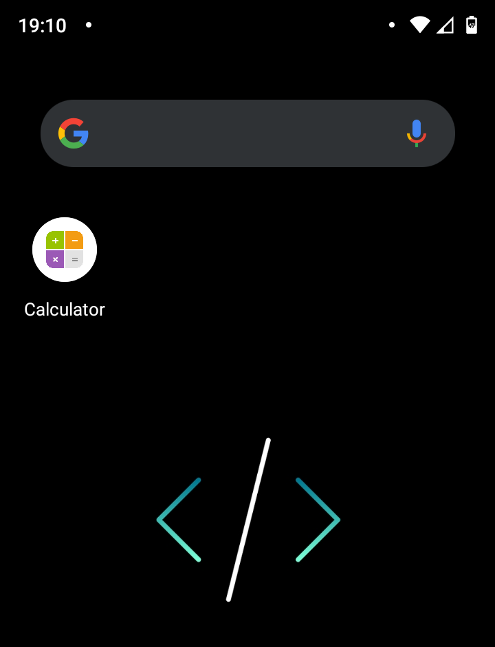
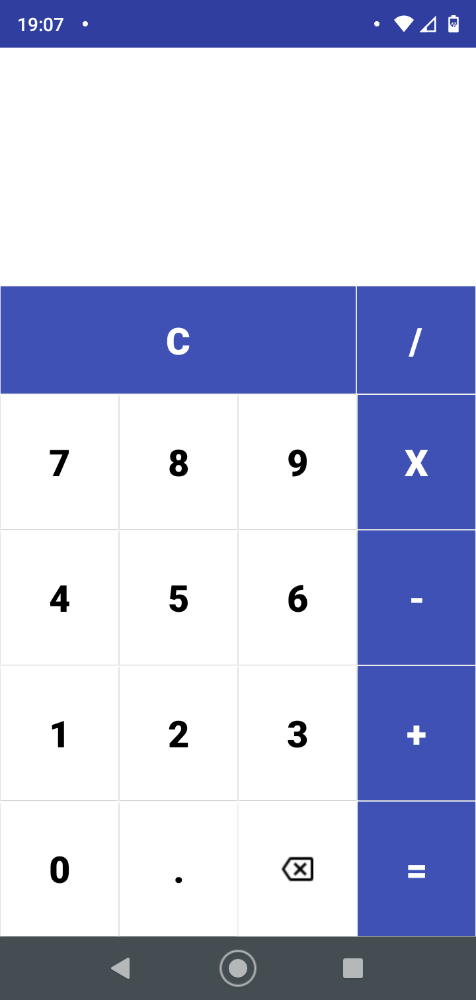
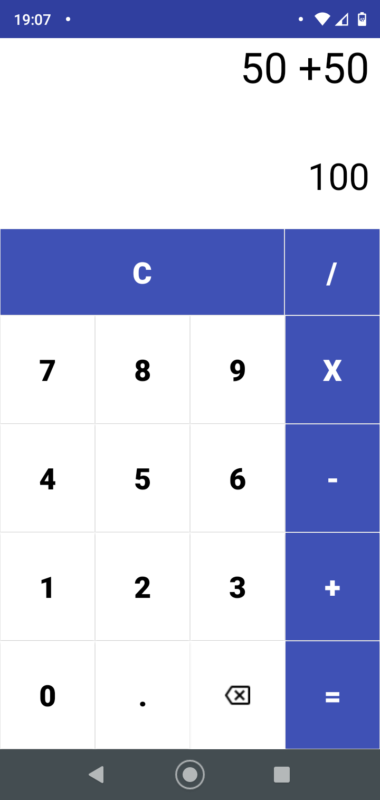

# Calculadora
### Simples app de calculadora com as operações basicas.(criado pelo celular📱)

> Um grande desafio.....meu primeiro app. Foi um pouco complicado, a inexperiência com o java, entender o que eu deveria fazer, procurar horas um erro que na verdade era a falta de um ";" ou a falta de fechar os "( )" 😂. Refiz o app do zero umas 6 vezes por não encontrar uma IDE que não bugasse, mas encontrei finalmente uma que criará meu primeiro app 🥰 (infelizmente ela não tem varias linguagens, seria muito legal fazer apps em kotlin , uma linguagem que estou aprendendo também ). Minha realidade de vida é um pouco diferente de algumas pessoas que estudam nesse ramo da programação, mas não é menos abençoada por Deus. Acredito que Deus nos vê como iguais e nos abençoa da mesma forma, talvez uns tenham mais facilidades e outros mais dificuldades. A *dificuldade*.....🤔......

> Moro em um bairro carente de Praia Grande, tenho duas filhas, uma de 4 anos e uma de 5 meses, meu marido é um presente que Deus me enviou ❤️, e estamos casados a 7 anos. Somente ele trabalha e no momento não temos condições de comprar um computador ou começar a faculdade de Engenharia da Computação (faculdade que eu gostaria muito de fazer quando Deus preparasse 😁). Nossa casinha é de madeira, com um comodo e um banheiro, mas não me gabando, é uma casinha de boneca rsrsrs😄. Internet de fibra ainda não chegou em nossa rua, então graças a Deus ainda temos via radio, caso contrario não conseguiria estudar. Estudar......mesmo não tendo condições de pagar cursos e etc.....a internet é recheada de informações, e eu vou te falar, entro em cada burraquinho e espacinho, fuçando cada canto dessa imensa rede de informações para descobrir como fazer cada coisinha nesse maravilhoso mundo da programação.

> Eu sonho um dia estar trabalhando em frente a um setup simples, mas lindo e colorido, fazendo apps, solucionando problemas, deixando a equipe satisfeita com o meu serviço e o usuario final feliz❣️

### Esse primeiro app significa o começo dessa jornada. Simples e com algumas falhas, mas com toda dedicação, perseverança e principalmente com muito amor.

Aqui vai algumas fotos do app:

# O app precisa de alguns ajustes e se você puder me dar algumas dicas e sugestões entre em contato comigo.😁
e-mail: ruth09@yahoo.com
